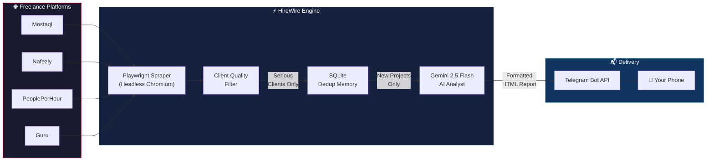
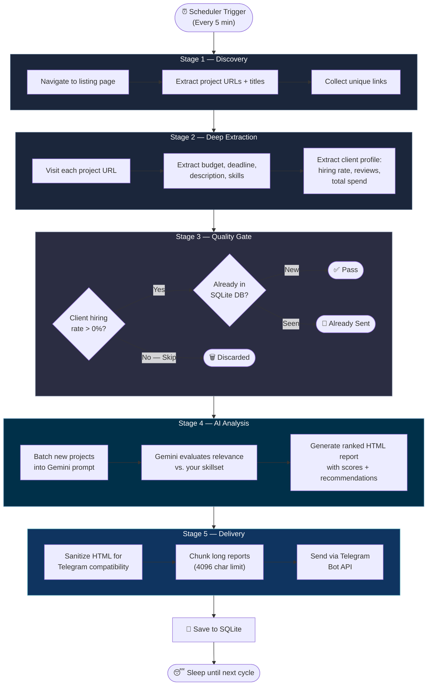
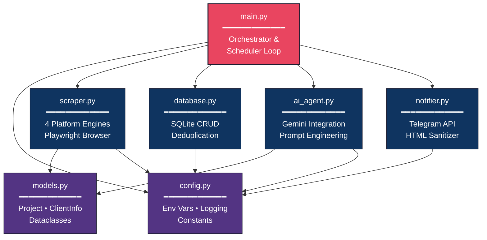

# ⚡ HireWire — Autonomous Freelance AI Scout

> _Stay tapped into the hiring wire 24/7._

An autonomous AI-powered bot that scouts high-quality programming and development projects across **4 major freelance platforms** (Mostaql, Nafezly, PeoplePerHour, Guru). It filters out unserious clients, uses **Google Gemini AI** to analyze project requirements against your specific criteria, and delivers highly relevant opportunities directly to your **Telegram** in real time.

## ✨ Features

- **Multi-Platform Scraping**: Supports Mostaql, Nafezly, PeoplePerHour (PPH), and Guru.
- **Client Quality Filtering**: Automatically ignores clients with a 0% hiring rate to focus on serious buyers.
- **AI-Powered Analysis**: Uses **Google Gemini (gemini-2.5-flash)** to deeply evaluate project descriptions and match them against your personal skillset and criteria.
- **Telegram Delivery**: Sends formatted alerts to your Telegram chat immediately when a matching project is found.
- **Deduplication**: Uses SQLite memory (`mostaql_memory.db`) to ensure you never receive the same project twice, tracking state across restarts.
- **Anti-Bot Protections**: Headless Chromium with Playwright, human-like delays, and user-agent spoofing to avoid platform blocks.

---

## 🏗️ Architecture

### High-Level System Flow



### Data Pipeline Detail



### Module Architecture



### Project Structure

```
HireWire-/
├── main.py            # 🎯 Entry point — orchestrator & scheduler
├── config.py          # ⚙️ Environment config, logging, constants
├── models.py          # 📦 Data models (Project, ClientInfo)
├── scraper.py         # 🕷️ Multi-platform Playwright scraper engines
├── ai_agent.py        # 🧠 Gemini AI analysis & report generation
├── notifier.py        # 📬 Telegram delivery with HTML sanitization
├── database.py        # 💾 SQLite deduplication memory layer
├── requirements.txt   # 📋 Python dependencies
├── .env.example       # 🔑 Template for API credentials
├── .gitignore         # 🚫 Ignored files (venv, .env, db, logs)
└── logs/              # 📜 Rotating log files & error screenshots
```

### Tech Stack

| Layer | Technology | Purpose |
|-------|-----------|---------|
| **Runtime** | Python 3.10+ | Core language |
| **Browser Engine** | Playwright (Chromium) | JavaScript rendering & anti-bot bypass |
| **AI** | Google Gemini 2.5 Flash | Project analysis & relevance scoring |
| **Database** | SQLite | Lightweight deduplication memory |
| **Notifications** | Telegram Bot API | Real-time alert delivery |
| **Scheduling** | `schedule` library | Periodic execution (every 5 min) |
| **Config** | `python-dotenv` | Secure environment variable loading |

---

## 🛠️ Prerequisites

Before you install, ensure you have the following installed on your machine or server:
- **Python 3.10** or higher
- **pip** and **venv**

You will also need:
1. **Google Gemini API Key**: Get it from [Google AI Studio](https://aistudio.google.com/).
2. **Telegram Bot Token**: Message [@BotFather](https://t.me/BotFather) on Telegram to create a bot and get the Token.
3. **Telegram Chat ID**: Message [@userinfobot](https://t.me/userinfobot) or use your bot to find your unique Chat ID.

---

## 🚀 Installation & Setup

Follow these steps to deploy the scout on your local machine or an unmanaged VPS.

### 1. Clone the Repository

```bash
git clone https://github.com/Ahmed2300/HireWire-.git
cd HireWire-
```

### 2. Set Up a Virtual Environment

It is highly recommended to isolate the project dependencies using a Python virtual environment.

```bash
# Windows
python -m venv venv
.\venv\Scripts\activate

# Linux / macOS
python3 -m venv venv
source venv/bin/activate
```

### 3. Install Requirements

```bash
pip install -r requirements.txt
```

### 4. Install Playwright Browsers

The scraper uses Playwright to render JavaScript-heavy frontend platforms. You must download the Chromium binaries:

```bash
playwright install chromium
```

---

## ⚙️ Configuration

Create a `.env` file in the root directory by copying the example:

```bash
cp .env.example .env
```
*(If `.env.example` does not exist, simply create a `.env` text file).*

Edit the `.env` file and insert your API credentials:

```ini
# .env
GEMINI_API_KEY="AIzaSyYourGeminiKeyHere............"
TELEGRAM_BOT_TOKEN="123456789:ABCdefGHIjklMNOpqrSTUvwxYZ"
TELEGRAM_CHAT_ID="987654321"
```

### Advanced Settings (`config.py`)

If you want to tweak how the bot behaves, open `config.py` and modify the constants:

- **`MIN_HIRING_RATE`**: Default is `1`. Filters out any client who has a 0% hiring rate.
- **`INTERVAL_MINUTES`**: Default is `5`. How often the bot scans for new jobs.
- **`AI_CRITERIA`**: The prompt passed to Gemini telling it what you are looking for (e.g., "Web development, Python, bug fixes").
- **`GEMINI_MODEL`**: Default is `"gemini-2.5-flash"`. Change to `gemini-pro` or equivalent if needed.

---

## ▶️ Running the Bot

### Local Testing

To run the bot locally in your terminal, make sure your virtual environment is active, then execute:

```bash
# On Windows
.\venv\Scripts\activate
python main.py

# On Linux / macOS
source venv/bin/activate
python main.py
```
You should see colorful logging output and eventually receive a "Startup Ping" message on your Telegram to confirm connectivity.

### Server Deployment (Production)

If you are running this on a remote server (like AWS, DigitalOcean, or Hetzner), you want the bot to stay alive after you disconnect your SSH session.

**Option A: Using `screen` or `tmux` (Easiest)**
```bash
# Start a new tmux session
tmux new -s hirewire

# Activate venv and run
source venv/bin/activate
python main.py

# Detach from session by pressing: Ctrl+B, then D
```

**Option B: Using `PM2` (Robust)**
```bash
# Install pm2 globally via npm
npm install -g pm2

# Start the python script
pm2 start main.py --name "hirewire" --interpreter ./venv/bin/python

# Save pm2 state
pm2 save
pm2 startup
```

**Option C: Using Systemd (Native Linux)**
Create a service file `/etc/systemd/system/hirewire.service`:
```ini
[Unit]
Description=HireWire — Autonomous Freelance AI Scout
After=network.target

[Service]
User=your_linux_user
WorkingDirectory=/path/to/HireWire-
ExecStart=/path/to/HireWire-/venv/bin/python main.py
Restart=always

[Install]
WantedBy=multi-user.target
```
Enable and start the service:
```bash
sudo systemctl enable hirewire
sudo systemctl start hirewire
```

---

## 🗄️ Database Management

The bot uses a lightweight local SQLite database (`mostaql_memory.db`) to record which projects have been seen and sent to AI.
- By default, `main.py` runs a cleanup routine on startup that deletes entries older than 30 days.
- If you ever want to reset the bot and force it to re-evaluate all currently active projects on the platforms, simply delete the database file:
  ```bash
  rm mostaql_memory.db
  ```
  It will be automatically recreated on the next run.

---

## 📜 Logs

Logs are printed to the console (with color-coded severity) and also written locally to a `logs/` directory.
- `logs/agent.log`: A rotating file log holding historical execution data and debug paths.
- If a scraper encounters a critical DOM error or anti-bot challenge, it attempts to capture a screenshot (`logs/*_error.png`) so you can visually inspect what went wrong.

---

## 🤝 Contributing

Platform DOM structures (class names, selectors) frequently change. If the bot stops finding jobs on a specific website, you will likely need to update the CSS selectors in `scraper.py`.

1. Run the script manually.
2. Check the console output or `logs/agent.log`.
3. Update `page.locator(".class-name")` inside `scraper.py` respective to the platform module (e.g., `_scrape_pph_project`).
